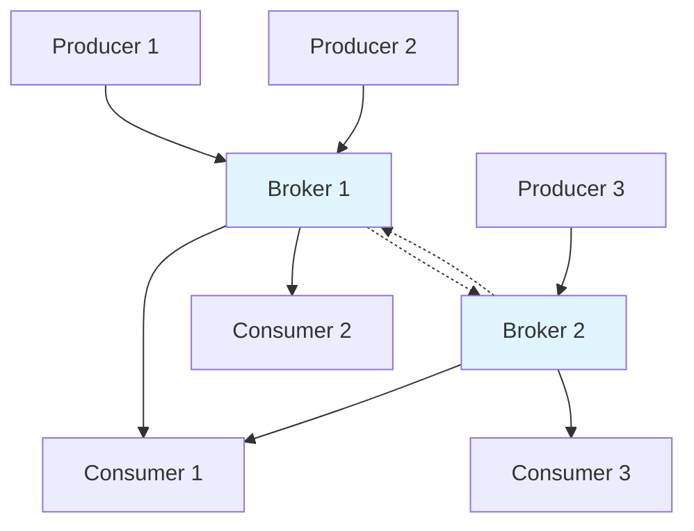
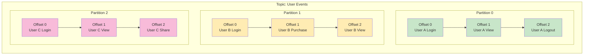
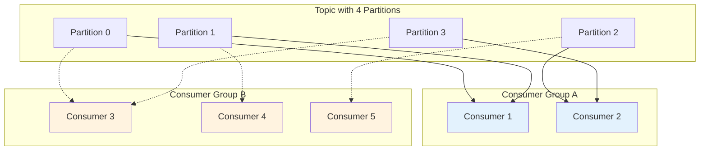
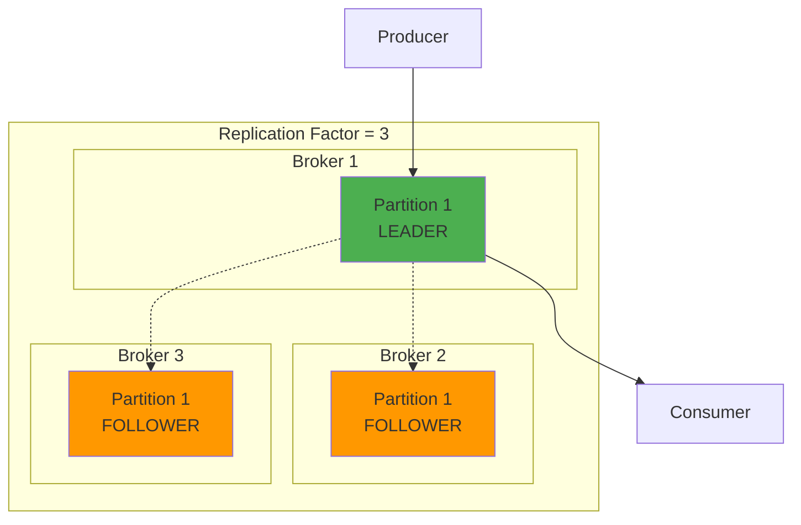
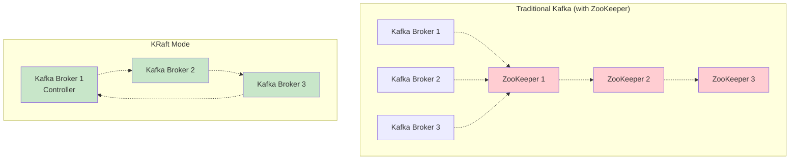
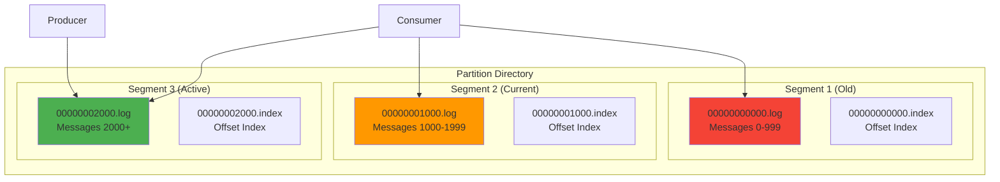
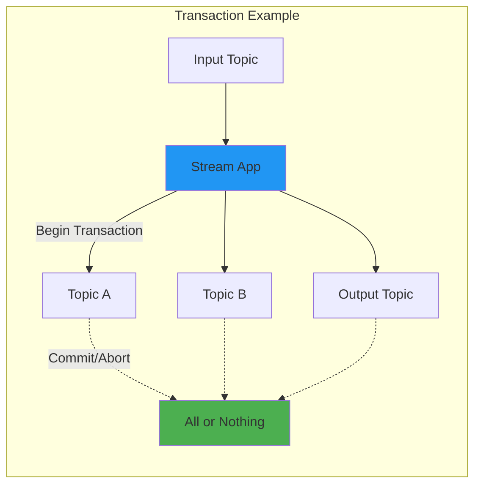

# Kafka Internal Concepts - Study Guide

---

## 🏗️ Kafka Architecture

### What is the main role of a Kafka broker?
**Answer:** To receive, store, and serve messages to producers and consumers

**Key Points:**
- Acts as the central hub for message storage and distribution
- Receives messages from producers and stores them persistently on disk
- Serves messages to consumers upon request
- Handles partition management across the cluster
- Manages replication for fault tolerance
- Can handle thousands of partitions and millions of messages
- Forms the backbone of Kafka's distributed messaging system

---

## 📂 Topics and Partitions

### Which statement is true about Kafka partitions?
**Answer:** Each partition is an ordered, immutable sequence of messages

**Key Points:**
- Partitions maintain strict message ordering within themselves
- Once written, messages cannot be changed or deleted (immutable)
- Each message receives a unique offset number within its partition
- Immutability ensures reliability and consistency
- Essential for event sourcing and stream processing applications
- Ordering guarantee is only within a single partition, not across partitions
- Enables Kafka to scale horizontally while maintaining order semantics

---

## 🎯 Offsets and Consumer Groups

### What happens when multiple consumers in the same group subscribe to a topic with 4 partitions?
**Answer:** The consumers share the partitions among themselves

**Key Points:**
- Kafka automatically distributes partitions among consumers in the same group
- Each partition is consumed by only one consumer within a group at any time
- Enables horizontal scaling and parallel processing
- Load balancing happens automatically when consumers join or leave
- Example: 4 partitions + 2 consumers = 2 partitions per consumer
- Adding more consumers triggers rebalancing for optimal distribution
- Different consumer groups receive all messages independently

---

## 🛡️ Replication and Fault Tolerance

### What is the purpose of the replication factor in Kafka?
**Answer:** To maintain copies of data for fault tolerance

**Key Points:**
- Creates multiple copies of each partition across different brokers
- Ensures data durability and system availability
- One replica acts as the leader (handles reads/writes)
- Other replicas are followers that replicate data
- Automatic leader election when the current leader fails
- Replication happens transparently to producers and consumers
- Higher replication factor = better fault tolerance but more storage overhead
- Common replication factors: 3 for production, 1 for development

---

## 🗂️ Log Segments and Retention

### Kafka deletes older messages from a partition based on:
**Answer:** Retention policy (time or size-based)

**Key Points:**
- Retention is independent of whether messages have been consumed
- Time-based retention: Keep messages for X days (e.g., 7 days)
- Size-based retention: Keep only X GB of data per partition
- Different from traditional message queues that delete after consumption
- Enables multiple consumers to read the same messages
- Allows message replay and reprocessing scenarios
- Retention policies can be configured per topic
- Makes Kafka behave more like a distributed log than a queue

---

## ⚖️ Consumer Group Rebalancing

### What triggers a consumer group rebalance in Kafka?
**Answer:** A new consumer joins or an existing one leaves

**Key Points:**
- Rebalancing redistributes partition assignments for optimal load distribution
- Triggered when consumer group membership changes
- Common triggers: consumer joins, consumer leaves/fails, partition count changes
- All consumers temporarily stop processing during rebalance
- Group coordinator manages the rebalancing process
- Brief interruption in message processing during rebalance
- Proper consumer configuration minimizes unnecessary rebalances
- Rebalance strategies: Range, Round Robin, Sticky, Cooperative Sticky

---

## 🔄 In-Sync Replicas (ISR)

### In Kafka, what qualifies a replica to be part of the ISR (In-Sync Replica) set?
**Answer:** A replica that has caught up with the leader within the defined replica.lag.time.max.ms

**Key Points:**
- ISR set contains replicas that are sufficiently caught up with the leader
- Replica must stay within configured lag threshold (replica.lag.time.max.ms)
- Only ISR replicas are eligible to become leaders
- Kafka waits for all ISR replicas before acknowledging writes (with acks=all)
- Replicas removed from ISR if they fall too far behind
- Replicas can rejoin ISR once they catch up again
- ISR size affects write acknowledgment and durability guarantees
- Critical for maintaining Kafka's consistency and availability

---

## 🧹 Log Compaction

### Which statement best describes log compaction in Kafka?
**Answer:** It retains the latest value per key, discarding older ones

**Key Points:**
- Specialized cleanup policy different from time/size-based retention
- Preserves only the most recent value for each unique message key
- Older values for the same key are discarded during compaction
- Perfect for maintaining state or configuration data
- Use cases: user profiles, configuration management, changelog topics
- Results in a snapshot of latest state for all keys
- Compacted topics can be used for state restoration
- Messages without keys are never compacted
- Compaction happens asynchronously in the background

---

## 🔧 Kafka without Zookeeper (KRaft Mode)

### In recent Kafka versions, what does the KRaft mode replace?
**Answer:** Apache ZooKeeper

**Key Points:**
- KRaft eliminates the external dependency on Apache ZooKeeper
- Uses Raft consensus protocol implemented directly within Kafka
- Simplifies deployment and reduces operational complexity
- Improves cluster scalability and performance
- Reduces the number of moving parts in Kafka infrastructure
- Eliminates potential single point of failure from ZooKeeper
- Better resource utilization without separate ZooKeeper cluster
- Represents major architectural evolution in Kafka

---

## 🎛️ Kafka Controller

### What is the Kafka Controller responsible for?
**Answer:** Assigning partitions to brokers and handling leader elections

**Key Points:**
- Only one broker serves as controller at any given time
- Handles cluster-wide coordination responsibilities
- Manages partition leadership elections when brokers fail
- Oversees broker registration and deregistration
- Propagates metadata changes throughout the cluster
- Monitors health of all brokers and their partitions
- Ensures every partition has an available leader
- In KRaft mode, managed through internal Raft consensus protocol
- Controller election happens automatically when current controller fails

---

## 📨 Message Delivery Semantics

### Kafka supports which of the following delivery guarantees out of the box?
**Answer:** At-most-once, at-least-once, and exactly-once

**Key Points:**
- **At-most-once**: Messages may be lost but never duplicated
  - Prioritizes performance and availability over durability
  - No retries, fire-and-forget approach
- **At-least-once**: No message loss, but duplicates possible
  - Uses retries and careful offset management
  - Most commonly used delivery guarantee
- **Exactly-once**: Strongest guarantee, no loss or duplicates
  - Requires idempotent producers and transactional APIs
  - Most complex to implement but provides strongest consistency
- Choice depends on application's tolerance for data loss vs duplicates

---

## ✅ Producer Acknowledgment (acks)

### What happens if the Kafka producer sets acks=all?
**Answer:** The message is considered "acknowledged" only when all in-sync replicas confirm the write

**Key Points:**
- Provides strongest durability guarantee available
- Producer waits for confirmation from all In-Sync Replicas (ISR)
- Ensures maximum data safety even with multiple broker failures
- Message survives as long as at least one ISR remains
- Trade-off: Higher latency due to waiting for all replicas
- Alternative settings: acks=0 (no wait), acks=1 (leader only)
- Essential for applications requiring strong consistency
- Works in conjunction with min.insync.replicas setting

---

## 💾 Kafka Storage Internals

### Each Kafka partition is stored as:
**Answer:** A series of log segment files, each with a size/time limit

**Key Points:**
- Partitions stored as multiple segment files, not single monolithic files
- New segment created when size limit (e.g., 1GB) or time limit reached
- Enables efficient deletion of old data by removing entire segments
- Improves I/O performance by limiting individual file sizes
- Facilitates log compaction and maintenance operations
- Better disk space management and backup procedures
- Each segment contains sequential messages with continuous offsets
- Index files accompany each segment for fast message lookup

---

## 🔒 Idempotent Producer

### What does enabling idempotence in a Kafka producer do?
**Answer:** Guarantees messages are written only once even with retries

**Key Points:**
- Eliminates duplicate messages caused by producer retries
- Assigns unique sequence numbers to each message from a producer
- Kafka detects and ignores duplicate attempts using sequence numbers
- Essential component for exactly-once semantics
- Works seamlessly with Kafka's built-in retry mechanisms
- Prerequisite for using Kafka transactions
- No application code changes required once enabled
- Prevents "at-least-once" duplicates without sacrificing reliability

---

## 🔄 Kafka Transactions

### What do Kafka transactions ensure when used properly with a producer?
**Answer:** A group of messages is either fully committed or fully aborted

**Key Points:**
- Enables atomic writes across multiple partitions and topics
- Messages remain invisible to consumers until transaction commits
- All-or-nothing behavior for message groups
- Essential for exactly-once processing scenarios
- Supports complex stream processing workflows
- Transaction can be explicitly committed or aborted
- Failed transactions automatically abort and clean up
- Critical for consume-process-produce patterns without partial updates

---

## 🏪 Kafka Streams State Management

### Where does Kafka Streams store its local state during processing?
**Answer:** In a RocksDB instance and backed by a changelog topic

**Key Points:**
- Dual storage approach: local + distributed backup
- RocksDB provides fast local key-value storage
- All state changes logged to Kafka changelog topic
- Achieves low latency through local data access
- Maintains fault tolerance through distributed backup
- State can be rebuilt after failures by replaying changelog
- Each Streams instance manages its own state shard
- Supports both in-memory and persistent state stores
- Enables stateful stream processing operations like joins and aggregations

---

## 🔑 Message Keys and Partitioning

### Kafka uses the message key to:
**Answer:** Determine the partition where the message should be placed

**Key Points:**
- Message key determines partition assignment within a topic
- Uses partitioner function (typically hash-based) for distribution
- Messages with same key always go to same partition
- Ensures ordering for related messages (same key)
- Enables effective scaling while preserving order semantics
- Example: All events for User ID "123" go to same partition
- Null keys result in round-robin partition assignment
- Custom partitioners can implement different distribution strategies

---

## 🗳️ Leader Election (Old vs New)

### In Kafka versions prior to KRaft, which component handled leader election for partitions?
**Answer:** ZooKeeper

**Key Points:**
- ZooKeeper managed all cluster coordination before KRaft
- Stored critical metadata: broker list, partition assignments, ISR status
- Handled controller election among brokers
- Coordinated partition leader elections during failures
- Maintained cluster configuration and topic metadata
- Created operational dependency on external system
- Required separate ZooKeeper cluster maintenance
- KRaft mode now handles all these responsibilities internally

---

## ⚖️ Min.insync.replicas Setting

### What happens if the number of in-sync replicas falls below min.insync.replicas?
**Answer:** Producers with acks=all will receive an error and fail to write

**Key Points:**
- Safety mechanism to prevent data loss in degraded conditions
- Protects against writing to insufficient replicas
- Producers with acks=all receive NotEnoughReplicasException
- Maintains durability guarantees even during broker failures
- Example: replication.factor=3, min.insync.replicas=2
- Writes rejected if only 1 replica remains in sync
- Forces applications to handle degraded cluster scenarios
- Balances availability vs consistency requirements

---

## 🔐 Kafka Authentication

### Which authentication mechanism is not supported natively by Kafka?
**Answer:** Basic Auth (username/password in plain HTTP header)

**Key Points:**
- Kafka security built on SASL and TLS, not HTTP-based auth
- **Supported mechanisms:**
  - SASL/PLAIN: Username/password over secure connections
  - SASL/GSSAPI: Kerberos integration for enterprise environments
  - OAuth 2.0: Modern authorization via SASL/OAUTHBEARER
- Authentication handled within Kafka's native protocol
- No reliance on potentially less secure HTTP methods
- Supports both authentication and authorization (ACLs)
- SSL/TLS encryption for data in transit
- Integration with external identity providers possible
